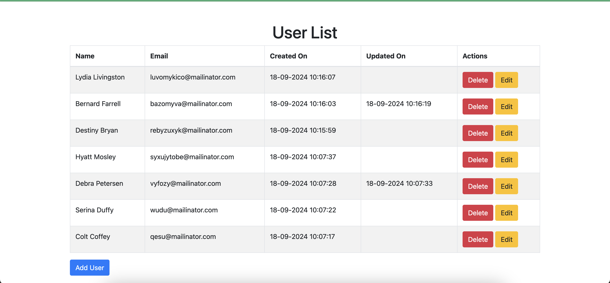
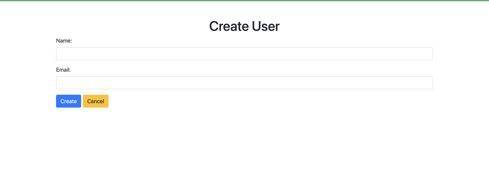
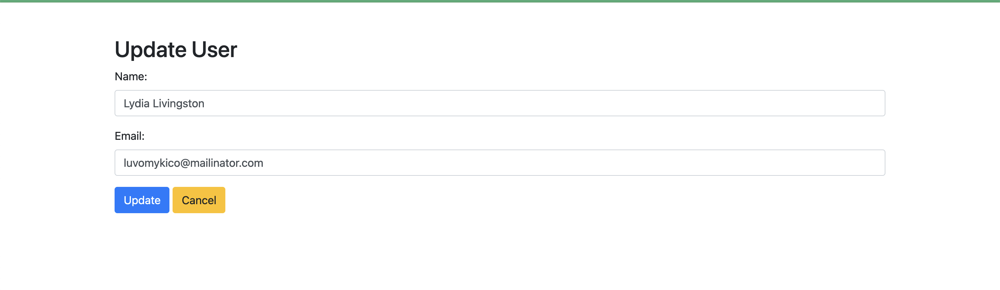

## Explanation:

***User.php***: Responsible for managing user data.<br>
***UserRepository.php***: Responsible for CRUD operations with the database.<br>
***UserService.php***: Handles business logic.<br>






# Start the server
```bash
php -S localhost:8000
```


